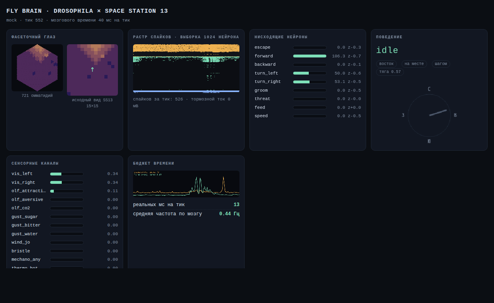

# flybrain-ss13

Цифровой двойник мозга дрозофилы за рулём персонажа в Space Station 13
(сборка [TauCetiClassic](https://github.com/TauCetiStation/TauCetiClassic)).

Игра отдаёт наружу то, что видит и чувствует тело. Питоновский демон
прогоняет это через спайковую модель коннектома FlyWire — 139 тысяч нейронов,
14 миллионов связей — и снимает активность с нисходящих нейронов, тех самых,
которые у настоящей мухи командуют ходьбой. Команда возвращается в игру, и
человек делает шаг.

```
   SS13 (BYOND/DM)                        Python-демон
┌────────────────────┐               ┌───────────────────────┐
│ view(7) -> сетка   │  сенсорика    │ кодировщик            │
│ свет/стены/мобы    │ ────────────► │  -> пуассоновский вход│
│ боль, голод, газы  │   ~1 КБ JSON  │     в сенсорные нейроны│
│                    │               │           │            │
│                    │               │           ▼            │
│                    │               │ LIF-модель коннектома  │
│                    │               │ FlyWire, 50 мс/тик     │
│                    │               │           │            │
│ set_dir/step/emote │ ◄──────────── │           ▼            │
│                    │   моторная    │ декодер DN             │
└────────────────────┘    команда    │ DNp09/MDN/DNa01/DNp01  │
                                     └───────────────────────┘
```

Нейроны настоящие: это реконструкция мозга взрослой дрозофилы из
[FlyWire](https://flywire.ai/), параметры LIF взяты из
[Shiu et al., Nature 2024](https://www.nature.com/articles/s41586-024-07763-9).
Игровыми костылями остаются кодировщик сенсорики (у SS13 нет запахов, есть
реагенты) и декодер моторики (у мухи шесть ног, у SS13 четыре направления).
Где именно кончается биология и начинается инженерия — расписано в
[docs/MAPPING.md](docs/MAPPING.md).

---

## Быстрый старт без данных FlyWire

Посмотреть, как всё работает, можно прямо сейчас: есть синтетический
коннектом с той же статистикой связности и слоистыми путями
сенсорика → интернейроны → нисходящие нейроны.

```bash
cd python
python3 -m flybrain.server --synthetic 30000 --secret test --dt 1.0 --brain-ms 40
# в другом окне:
python3 tests/mock_ss13.py --secret test --ticks 250
```

Дашборд: <http://127.0.0.1:5665/viz>



Слева — то, что муха видит: 721 фасетка и рядом исходная сетка SS13.
В центре — растр спайков тремя полосами: сенсорика, остальной мозг,
нисходящие нейроны. Справа — их частоты с z-оценками и текущее поведение.
Если между вами и демоном стоит прокси, режущий event-stream, добавьте
`?poll=1` — дашборд перейдёт на обычный опрос.

Типичный вывод мок-станции:

```
тиков: 250   шагов: 110   упёрлась в стену: 4 раз
уникальных клеток посещено: 86
round-trip: медиана 15 мс, p95 20 мс
распределение состояний: idle=121, forward=83, escape-run=16, escape=15, groom=15
```

## Полный запуск

### 1. Коннектом

```bash
cd python
python3 scripts/fetch_connectome.py --all     # ~300 МБ из бакета Codex
python3 scripts/build_connectome.py           # несколько минут -> data/connectome.npz
python3 scripts/calibrate.py                  # что до чего доходит
```

`calibrate.py` — главный инструмент настройки: он по очереди накачивает
каждую сенсорную популяцию и печатает, какие нисходящие нейроны отвечают.
Если строка пустая, путь не пробивается — крутите `model.gain` или
`runtime.input_drive_mv`.

### 2. Демон

```bash
cp flybrain.example.json flybrain.json     # поправьте secret
py -m flybrain.server --config flybrain.json
# либо: docker compose up
```

### 3. Игра

См. [dm/INSTALL.md](dm/INSTALL.md). Коротко: скопировать
`dm/code/modules/flybrain` в репозиторий, дописать девять `#include`
в `.dme`, положить `librust_g.so` рядом с dreamdaemon, заполнить
`config/flybrain.txt`, собрать. В игре: **Fun → Fly Brain: посадить муху
в человека**.

---

## Транспорт: медленно через файлы или напрямую через хуки

Оба варианта в комплекте, переключается строкой в конфиге.

| | `rustg` | `file` |
|---|---|---|
| как | `call()` в нативную библиотеку, запрос уходит в поток Rust | `world.ext_python()` -> shell -> файл |
| задержка | 1–3 мс, DM не ждёт | 50–200 мс, порождается процесс |
| потолок | 15–30 Гц | 2–5 Гц |
| что нужно | `librust_g.so` рядом с dreamdaemon | ничего, работает на голом репозитории |

Обе ветки ходят в один и тот же демон, поэтому коннектом грузится ровно
один раз. Файловый путь не запускает мозг заново на каждый тик — он
запускает тонкий клиент на стандартной библиотеке, который просто
перекладывает пакет в HTTP.

Ответ приезжает в теле того же запроса, который DM сделал сам, поэтому
обратный канал в `world/Topic()` для основного цикла не нужен. Он есть
и работает, но только для внеполосных команд — см. `dm/world.dm.patch`.

Подробности и обоснование, почему не `world.Export()`, — в
[docs/ARCHITECTURE.md](docs/ARCHITECTURE.md).

---

## Что померено

На двух слабых облачных ядрах, 139 000 нейронов, 14 млн связей, `dt = 1 мс`:

| | |
|---|---|
| 50 мс мозгового времени | 57 мс реального (медиана), p95 65 мс |
| отношение к реальному времени | ×0.88 |
| потолок частоты тиков | 17.5 Гц |
| память | 1.3 ГБ на процесс, ~2 МБ на каждую дополнительную муху |
| round-trip игра↔мозг (rustg) | 14–20 мс |

Числа с обычного десктопа будут в разы лучше. Тюнинг и профили —
в [docs/PERFORMANCE.md](docs/PERFORMANCE.md).

---

## Тесты

```bash
cd python
python3 tests/run_tests.py        # 33 теста, pytest не нужен
```

Проверяются: соответствие движка уравнениям Shiu et al. (покой, порог,
рефрактерность, синаптическая задержка, обнуление `g` при сбросе),
кодировщик (упаковка, адаптация, разделение полей зрения), декодер
(приоритетная лестница, рулёжка, спонтанные вспышки ходьбы) и протокол
DM↔Python, включая построчную транскрипцию двух процедур из `_flybrain.dm`.

**DM-часть здесь не компилировалась** — BYOND и SpacemanDMM в это окружение
не ставятся. Перед первым запуском прогоните `dreamchecker` или
`DreamMaker taucetistation.dme`; список того, что я сверял по исходникам
вручную, — в конце [docs/ARCHITECTURE.md](docs/ARCHITECTURE.md).

---

## Структура

```
dm/                     что кладётся в репозиторий игры
  code/modules/flybrain/  девять .dm файлов, ядро не трогают
  INSTALL.md              пошаговая установка
  world.dm.patch          необязательная правка для обратного канала
python/
  flybrain/             пакет: коннектом, LIF, кодировщики, декодер, сервер
  flybrain/viz/         дашборд
  scripts/              скачать коннектом, собрать, откалибровать, клиент для DM
  tests/                тесты + мок SS13
config/flybrain.txt     конфиг игровой стороны
docs/                   архитектура, карта сигналов, производительность
```

## Лицензии и цитирование

Данные FlyWire — CC BY-NC-SA 4.0, некоммерческое использование со ссылкой.
При публикации чего угодно на этих данных цитируются:

- Dorkenwald et al., *Nature* 2024 — реконструкция коннектома
- Schlegel et al., *Nature* 2024 — аннотации и типы клеток
- Shiu et al., *Nature* 2024 — модель LIF и её параметры

Код модуля выкладывается под той же лицензией, что и TauCetiClassic (AGPLv3),
чтобы его можно было мерджить в репозиторий без возни.
